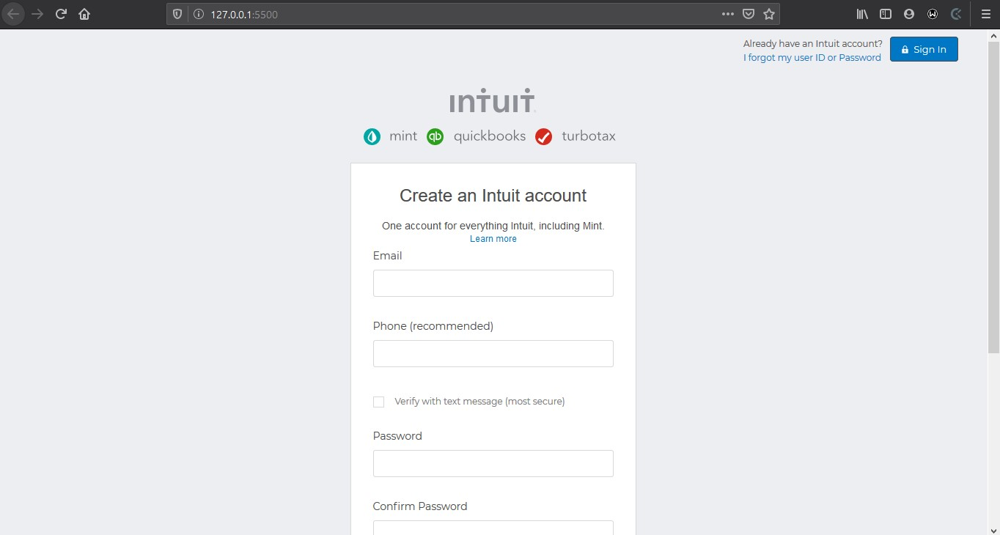

# Odin-Project-Form

# HTML FORMS

## This project consists of building an HTML document that matches the appearance of mint.com’s signup page

[Project-Specification](https://www.theodinproject.com/courses/html5-and-css3/lessons/html-forms)

[Demo](https://raw.githack.com/CornerstoneII/Odin-Project-Form/Signup-Clone/index.html)

## Built With

- HTML & CSS

## Authors

👤 **Author**

- Github: [@githubhandle](https://github.com/CornerstoneII)

- Linkedin: [linkedin](https://www.linkedin.com/in/oluwaseun-iyadi-773584b4/)

## 🤝 Contributing

Contributions, issues and feature requests are welcome!

Feel free to check the [issues page](issues/).

## Show your support

Give a ⭐️ if you like this project!
